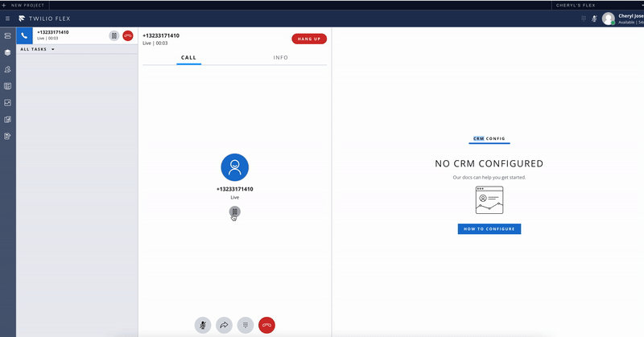

<a href="https://www.twilio.com">

</a>

# Twilio Flex Plugin - Hold time display

Twilio Flex Plugins allow you to customize the appearance and behavior of [Twilio Flex](https://www.twilio.com/flex). If you want to learn more about the capabilities and how to use the API, check out our [Flex documentation](https://www.twilio.com/docs/flex).

This plugin will display the hold time for when the agent puts the user on hold. The hold time would appear both on the agent view as well as the teams view.

Sample demo is provided below :




## Requirements

To deploy this plugin, you will need:

- An active Twilio account with Flex provisioned. Refer to the [Flex Quickstart](https://www.twilio.com/docs/flex/quickstart/flex-basics#sign-up-for-or-sign-in-to-twilio-and-create-a-new-flex-project") to create one.
- npm version 5.0.0 or later installed (type `npm -v` in your terminal to check)
- Node.js [long term support(LTS) version](https://nodejs.org/en/about/releases/)(type `node -v` in your terminal to check)

## Setup

Make sure you have [Node.js](https://nodejs.org) as well as [`npm`](https://npmjs.com) installed.

1.  Clone this repo:

	```bash
	https://github.com/twilio-professional-services/plugin-hold-time.git
	```

2. Go to the plugin directory

	```bash
	cd plugin-hold-time
	```

3. Install the dependencies

	```bash
	npm install
	```

4. Run plugin on a local environment using Twilio CLI :

	```bash
	twilio flex:plugins:start
	```

5. Deploy your plugin to your Flex project using Twilio CLI:

	```bash
	twilio flex:plugins:deploy --major --changelog "Notes for this version" --description "Functionality of the plugin"
	```

More detailed information about deploying Flex plugins can be found here: https://www.twilio.com/docs/flex/developer/plugins/cli/deploy-and-release
